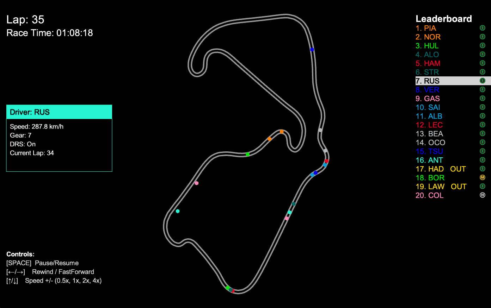

# F1 Race Replay 🏎️ 🏁

A Python application for visualizing Formula 1 race telemetry and replaying race events with interactive controls and a graphical interface.



## Features

- **Race Replay Visualization:** Watch the race unfold with real-time driver positions on a rendered track.
- **Leaderboard:** See live driver positions and current tyre compounds.
- **Lap & Time Display:** Track the current lap and total race time.
- **Driver Status:** Drivers who retire or go out are marked as "OUT" on the leaderboard.
- **Interactive Controls:** Pause, rewind, fast forward, and adjust playback speed using on-screen buttons or keyboard shortcuts.
- **Legend:** On-screen legend explains all controls.
- **Driver Telemetry Insights:** View speed, gear, DRS status, and current lap for selected drivers when selected on the leaderboard.

## Controls

- **Pause/Resume:** SPACE or Pause button
- **Rewind/Fast Forward:** ← / → or Rewind/Fast Forward buttons
- **Playback Speed:** ↑ / ↓ or Speed button (cycles through 0.5x, 1x, 2x, 4x)
- **Set Speed Directly:** Keys 1–4

## Qualifying Session Support (in development)

Recently added support for Qualifying session replays with telemetry visualization including speed, gear, throttle, and brake over the lap distance. This feature is still being refined.

## Requirements

- Python 3.8+
- [FastF1](https://github.com/theOehrly/Fast-F1)
- [Arcade](https://api.arcade.academy/en/latest/)
- numpy

Install dependencies:
```bash
pip install -r requirements.txt
```

FastF1 cache folder will be created automatically on first run. If it is not created, you can manually create a folder named `.fastf1-cache` in the project root.

## Usage

Run the main script and specify the year and round:
```bash
python main.py --year 2025 --round 12
```

To run a Sprint session (if the event has one), add `--sprint`:
```bash
python main.py --year 2025 --round 12 --sprint
```

The application will load a pre-computed telemetry dataset if you have run it before for the same event. To force re-computation of telemetry data, use the `--refresh-data` flag:
```bash
python main.py --year 2025 --round 12 --refresh-data
```

### Qualifying Session Replay

To run a Qualifying session replay, use the `--qualifying` flag:
```bash
python main.py --year 2025 --round 12 --qualifying
```

To run a Sprint Qualifying session (if the event has one), add `--sprint`:
```bash
python main.py --year 2025 --round 12 --qualifying --sprint
```

## File Structure

```
f1-race-replay/
├── main.py                    # Entry point, handles session loading and starts the replay
├── requirements.txt           # Python dependencies
├── README.md                  # Project documentation
├── roadmap.md                 # Planned features and project vision
├── resources/
│   └── preview.png           # Race replay preview image
├── src/
│   ├── f1_data.py            # Telemetry loading, processing, and frame generation
│   ├── arcade_replay.py      # Visualization and UI logic
│   └── ui_components.py      # UI components like buttons and leaderboard
│   ├── interfaces/
│   │   └── qualifying.py     # Qualifying session interface and telemetry visualization
│   │   └── race_replay.py    # Race replay interface and telemetry visualization
│   └── lib/
│       └── tyres.py          # Type definitions for telemetry data structures
│       └── time.py           # Time formatting utilities
└── .fastf1-cache/            # FastF1 cache folder (created automatically upon first run)
└── computed_data/            # Computed telemetry data (created automatically upon first run)
```

## Customization

- Change track width, colors, and UI layout in `src/arcade_replay.py`.
- Adjust telemetry processing in `src/f1_data.py`.

## Contributing

There have been serveral contributions from the community that have helped enhance this project. I have added a [contributors.md](./contributors.md) file to acknowledge those who have contributed features and improvements.

If you would like to contribute, feel free to:

- Open pull requests for UI improvements or new features.
- Report issues on GitHub.

Please see [roadmap.md](./roadmap.md) for planned features and project vision.

# Known Issues

- The leaderboard appears to be inaccurate for the first few corners of the race. The leaderboard is also temporarily affected by a driver going in the pits. At the end of the race the leadeboard is sometimes affected by the drivers final x,y positions being further ahead than other drivers. These issues are known issues caused by innacuracies in the telemetry and being worked on for future releases. Its likely that these issues will be fixed in stages as improving the leaderboard accuracy is a complex task.

## 📝 License

This project is licensed under the MIT License.

## ⚠️ Disclaimer

No copyright infringement intended. Formula 1 and related trademarks are the property of their respective owners. All data used is sourced from publicly available APIs and is used for educational and non-commercial purposes only.

---

Built with ❤️ by [Malladi Siva Rama Krishna]
